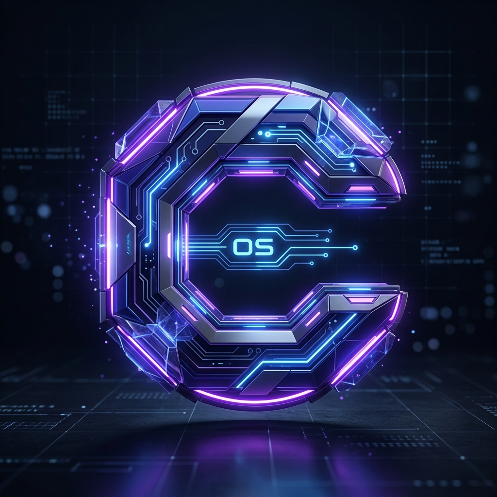

<div align="center">
  
  
  # 🌌 CreatorOS AI
  
  **The Ultimate Operating System for Digital Creators & EdTech**
  
  [](https://nextjs.org/)
  [](https://supabase.com/)
  [](https://tailwindcss.com/)
  [](https://www.typescriptlang.org/)
  [](https://vercel.com/)
  
  *Transform a single idea into scripts, voiceovers, hyper-realistic avatars, and captions. Publish everywhere — on autopilot.*
</div>

---

## 🚀 The Future of Content Creation

**CreatorOS AI** is an enterprise-grade, fully automated content generation ecosystem. Designed for top-tier YouTubers, digital educators, and high-growth marketing agencies, CreatorOS replaces fragmented workflows with a single, unified pipeline. From ideation to publishing, scale your digital presence with zero friction.

### 🌟 Premium Features

- 🧠 **Cognitive Script Engine**: Powered by state-of-the-art LLMs (Gemini / Ollama), instantly draft highly structured, engaging, and SEO-optimized educational scripts.
- 🎙️ **Neural Voice Studio**: Synthesize ultra-realistic, studio-quality AI voiceovers with precise emotional cadence and pacing.
- 👤 **Hyper-Realistic Avatar Studio**: Seamlessly integrate with D-ID to transform scripts into cinematic talking-head videos using lifelike AI avatars.
- 🖼️ **Click-Magnet Thumbnails**: Automatically design eye-catching, high-converting YouTube thumbnails tailored to your niche.
- 📝 **Dynamic Auto-Captions**: Generate pixel-perfect, timing-accurate captions for enhanced accessibility and maximum audience retention.
- 🚀 **One-Click YouTube Autopilot**: Connect your channel via secure OAuth and schedule or publish your AI-generated videos directly from the dashboard.
- 🔐 **Zero-Trust Security**: Enterprise-level passwordless OTP authentication backed by EmailJS and Supabase.
- 🎨 **Glassmorphism UI**: A breathtaking, award-winning dashboard design featuring blurred backdrops, glowing neon accents, and buttery-smooth micro-animations.

---

## 💻 Elite Tech Stack

Engineered for speed, scale, and reliability:

- **Frontend Architecture**: Next.js 14 (App Router), React 18, Server Components
- **Styling & UI**: Tailwind CSS, Radix UI, Framer Motion, Lucide Icons, Recharts
- **Backend & Database**: Supabase (PostgreSQL, Row-Level Security, Edge Functions, Storage)
- **AI Intelligence**: Google Gemini Pro / API, Ollama (Local LLM Fallback)
- **Media Generation**: D-ID Enterprise API
- **Communication**: EmailJS for reliable transactional OTPs
- **Infrastructure**: Deployed seamlessly on **Vercel** for edge-network latency and global availability

---

## 🛠️ Quick Start & Setup

### 1. Clone the Ecosystem
```bash
git clone https://github.com/supportcreatorosai/creatoros-web.git
cd creatoros-web
```

### 2. Configure Environment Secrets
Create a `.env` file in your root directory. Ensure this remains out of source control.
```env
# --- Supabase Core ---
NEXT_PUBLIC_SUPABASE_URL="your_supabase_url"
NEXT_PUBLIC_SUPABASE_ANON_KEY="your_supabase_anon_key"
POSTGRES_URL="your_postgres_url"

# --- AI & Media APIs ---
GEMINI_API_KEY="your_gemini_key"
D_ID_API_KEY="your_did_key"

# --- Authentication (EmailJS) ---
NEXT_PUBLIC_EMAILJS_SERVICE_ID="your_service_id"
NEXT_PUBLIC_EMAILJS_TEMPLATE_ID="your_template_id"
NEXT_PUBLIC_EMAILJS_PUBLIC_KEY="your_public_key"
NEXT_PUBLIC_EMAILJS_PRIVATE_KEY="your_private_key"
```

### 3. Install & Initialize
```bash
npm install
```

### 4. Launch Development Server
```bash
npm run dev
```
Experience the platform locally at [http://localhost:3000](http://localhost:3000).

---

## ⚡ Production Deployment (Vercel)

CreatorOS AI is optimized for Vercel edge deployment.

```bash
npm i -g vercel
vercel
vercel --prod
```
*Note: Ensure all your environment variables are perfectly mirrored in your Vercel project settings.*

---

## 📱 Flawless Responsiveness

CreatorOS AI refuses to compromise on aesthetics. The UI utilizes a premium **Glassmorphism** design language, guaranteeing a stunning visual experience. The entire dashboard is rigorously tested to scale perfectly—from massive 4k studio monitors down to mobile devices, ensuring you can manage your content empire from anywhere.

---

## 🤝 Join the Revolution

We are building the ultimate tool for creators. Contributions, feature requests, and issue reports are highly encouraged. Fork the repo, open a PR, and let's shape the future of media together.

---

<div align="center">
  <p>Engineered with 💙 by creators, for creators.</p>
  <p><strong>CreatorOS AI © 2026</strong></p>
</div>
